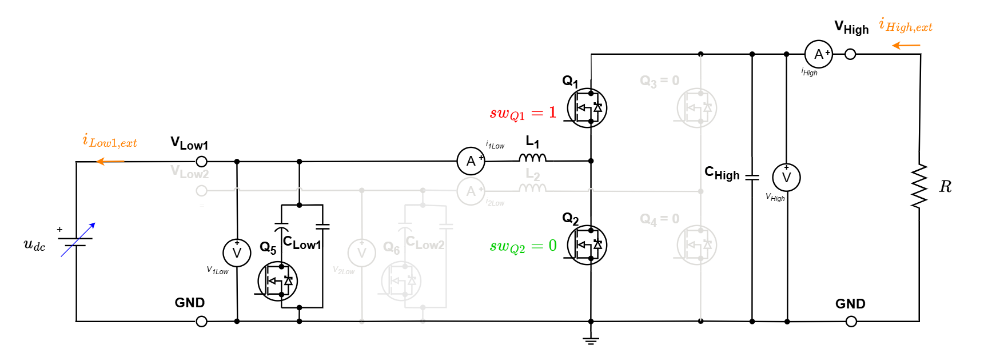

# Automated sensor calibration of the TWIST/SPIN board programmed as HB module

This example calibrates the six measurement chains of a TWIST board from MATLAB:

| Sensor   | Measurement                  |
|----------|------------------------------|
| `V_HIGH` | High-side voltage            |
| `I_HIGH` | High-side current            |
| `V1_LOW` | Low-side voltage, leg 1      |
| `I1_LOW` | Low-side current, leg 1      |
| `V2_LOW` | Low-side voltage, leg 2      |
| `I2_LOW` | Low-side current, leg 2      |

It automates the manual procedure (reading the serial monitor, writing the values in a spreadsheet and computing `SLOPE`/`INTERCEPT`). For each operating point, one MATLAB script:

1. drives the converter over the ThingSet serial link,
2. reads the raw board measurements 10 times and takes the mean,
3. captures the same signals with a PicoScope and takes the mean of the capture,
4. saves the point in a `.mat` file and plots every point recorded so far with the fitted line,
5. prints the `setConversionParametersLinear()` lines to paste in the firmware.

!!! attention Are you ready to start ?
    Before you can run this example, you must have successfully gone through the [getting started tutorial](https://docs.owntech.org/core/docs/environment_setup/).

## What is sensor calibration?

The board converts each raw ADC value into a physical value with a linear law:

$$X_{real} = gain \cdot X_{raw} + offset$$

- $X_{raw}$: raw value measured by the board sensor
- $X_{real}$: actual voltage or current, here measured by the PicoScope
- $gain$ and $offset$: the correction factors to determine

The firmware of this example sets every sensor to `gain = 1` and `offset = 0`, so the values it sends are the raw ADC values. For each sensor, the MATLAB script fits the line $X_{PicoScope} = gain \cdot X_{raw} + offset$ over all the points recorded, which gives the two factors directly.

## Required hardware

- 1 TWIST board (SPIN + TWIST shield)
- A DC power supply (0–48 V, current limited)
- A resistive load (or a DC electronic load)
- A PicoScope 4000 Series, with:
    - 2 voltage probes (10:1 in the default configuration)
    - 2 current clamps (100 mV/A in the default configuration)
- A 64-bit Windows PC with a USB connection to the board and to the PicoScope

## Required software

- Visual Studio Code with PlatformIO, to flash the firmware
- MATLAB R2020b or later, with the Instrument Control Toolbox
- PicoSDK and the PicoScope Support Toolbox + PicoScope 4000 Series (A API) MATLAB instrument driver (available from the MATLAB Add-On Explorer)

!!! warning Close the PicoScope desktop application
    MATLAB cannot connect to a PicoScope that is already open in the PicoScope application.

## Hardware setup

The board is programmed as a half-bridge (HB) module and **fed from the low side**. In power mode, the high switch of one leg is kept closed (duty cycle = 1) and the low switch open, so the leg connects the low side directly to the high side:

- the power supply `Udc` feeds `VLow1` (or `VLow2`),
- the current flows through the inductor and the closed high-side switch to `VHigh`,
- the resistive load `R` is connected between `VHigh` and `GND`.

The same current then flows through the low-side and high-side current sensors, and $V_{HIGH} \approx V_{LOW}$. Each operating point is obtained by changing the supply voltage `Udc`, which changes the voltages and the load current together.



The calibration is done in two runs, one per leg:

| Run  | Supply connected to | Board mode (`wmode`) | Sensors calibrated                    | Script                         |
|------|---------------------|----------------------|---------------------------------------|--------------------------------|
| LOW1 | `VLow1` – `GND`     | 1: `LEG1` at duty 1  | `V_HIGH`, `I_HIGH`, `V1_LOW`, `I1_LOW` | `calibration_supervisor_LOW1.m` |
| LOW2 | `VLow2` – `GND`     | 2: `LEG2` at duty 1  | `V_HIGH`, `I_HIGH`, `V2_LOW`, `I2_LOW` | `calibration_supervisor_LOW2.m` |

PicoScope wiring (default `sensorMap` of both scripts):

| PicoScope channel | Probe               | LOW1 run  | LOW2 run  |
|-------------------|---------------------|-----------|-----------|
| A                 | 10:1 voltage probe  | `V_HIGH`  | `V_HIGH`  |
| B                 | 100 mV/A clamp      | `I_HIGH`  | `I_HIGH`  |
| C                 | 10:1 voltage probe  | `V1_LOW`  | `V2_LOW`  |
| D                 | 100 mV/A clamp      | `I1_LOW`  | `I2_LOW`  |

!!! warning Operating range
    - Limit the supply current before switching it on.
    - Choose `R` so that the current stays within the current sensors' range. Currents below 1 A have a larger measurement error ([TWIST measurement chains](https://docs.owntech.org/1.0.0/twist/1.4.1/getting_started/#measurement-chains)), so spread the points over the range you will use, above 1 A when possible.
    - Keep the voltages and currents below 70 V and 6 A as limited by the board datasheet. The PicoScope channel can also saturate is its maximum values are achieved (the script warns with `over range`).

!!! tip Current clamp direction
    Orient every current clamp in the same direction as the current sensor on the board. A clamp on the inverse direction gives a negative gain. The good direction is given on the test configuration image.

## Firmware

The firmware exposes the raw measurements and the converter mode on a ThingSet shell, reachable from MATLAB on its own USB serial port (the board shows two COM ports: the console and the ThingSet shell).

| File                 | Content                                                                  |
|----------------------|--------------------------------------------------------------------------|
| `main.cpp`           | Sensors with `gain = 1`, `offset = 0`; LED heartbeat; power modes        |
| `user_data_objects.h`| ThingSet objects (table below)                                           |
| `app.conf`           | Enables the ThingSet stack and the shell                                 |
| `app.overlay`        | Adds the second USB serial port used by the ThingSet shell               |

ThingSet objects:

| Path                                   | Access | Content                                                        |
|----------------------------------------|--------|----------------------------------------------------------------|
| `Measurements/rVHigh_raw`              | read   | Raw `V_HIGH`                                                   |
| `Measurements/rV1Low_raw`, `rV2Low_raw`| read   | Raw `V1_LOW`, `V2_LOW`                                         |
| `Measurements/rI1Low_raw`, `rI2Low_raw`| read   | Raw `I1_LOW`, `I2_LOW`                                         |
| `Measurements/rIHigh_raw`              | read   | Raw `I_HIGH`                                                   |
| `Measurements/rMode`                   | read   | Current mode                                                   |
| `Config/wmode`                         | write  | 0 = idle, 1 = `LEG1` at duty cycle 1, 2 = `LEG2` at duty cycle 1 |
| `Config/wBlinkPeriod_s`                | write  | LED blink half-period in seconds (1 s after reset)             |

Switching between modes always stops the PWM first, so the two legs are never driven at the same time.

Flash the firmware with the PlatformIO **Upload** button (environment `USB`).

## MATLAB files

| File                                                | Role                                                     |
|-----------------------------------------------------|----------------------------------------------------------|
| `calibration_supervisor_LOW1.m`                     | Acquires one calibration point for the LOW1 run          |
| `calibration_supervisor_LOW2.m`                     | Acquires one calibration point for the LOW2 run          |
| `Aux_MATLAB_functions/calibration_fit_plot.m`       | Loads a calibration file, fits, plots and prints the parameters |
| `Aux_MATLAB_functions/ThingSetTools.m`              | ThingSet client over the serial port                     |
| `Aux_MATLAB_functions/picoscope_*.m`, `pico_select_voltage_range.m` | PicoScope connection, configuration and acquisition |
| `Data_records/calibration_<boardName>.mat`          | Saved calibration points (created by the scripts)        |

### Settings

Set MATLAB's current folder to `src`, then check the settings at the top of the script:

| Setting                 | Default                | Meaning                                                                          |
|-------------------------|------------------------|----------------------------------------------------------------------------------|
| `boardName`             | `"board_M6_LOW1"`      | Name of the calibration file. Use one name per board **and** per run (LOW1/LOW2) |
| `N_BOARD_READS`         | 10                     | Board reads averaged per point                                                   |
| `BOARD_READ_PAUSE_S`    | 0.1                    | Pause between two board reads (s)                                                |
| `SETTLE_TIME_S`         | 1.0                    | Wait after starting the converter, before measuring (s)                         |
| `BOARD_MODE`            | 1 (LOW1) / 2 (LOW2)    | Leg driven at duty cycle 1                                                       |
| `RESET_POINTS`          | `false`                | `true` discards the points already saved under `boardName`                      |
| `DISCONNECT_AT_END`     | `true`                 | Sets the board to idle and closes the board and PicoScope connections at the end |
| `KNOWN_PORTS`           | `""`                   | ThingSet COM port, `""` for auto-detection                                       |
| `BLINK_PERIOD_S`        | 0.5                    | LED blink period written after connection (link check)                          |
| `sensorMap`             | see wiring table       | One row per sensor, see below                                                    |
| `secondsPerDivision`    | 0.002                  | PicoScope capture: 10 divisions of 2 ms = 20 ms window                           |
| `picoMaxRangeV`         | 50                     | Largest input range of your PicoScope model (V)                                 |

Each `sensorMap` row is:

```matlab
% sensor,  ThingSet item, PicoScope serial, channel, probe gain, max expected, unit
'V_HIGH', 'rVHigh_raw',   '10133/0147',     1,       0.1,        50,           'V'; ...
```

- **channel**: 1 = A, 2 = B, ... Use `NaN` for a sensor not wired to the PicoScope in this run: its board value is saved but not plotted.
- **probe gain**: volts at the PicoScope input per unit measured: `1` for a direct connection, `0.1` for a 10:1 probe or a 100 mV/A clamp.
- **max expected**: largest value you will apply, in V or A. It sets the PicoScope range, with a 20 % margin.
- **PicoScope serial**: printed on the unit, or shown by the PicoScope application.

## Calibration procedure

### LOW1 run

1. Build and upload the code on the board. The LED blinks every 1 s. Connect PicoScope to the PC.
2. Wire the circuit with the power supply on `VLow1`, and the PicoScope as in the wiring table.
3. In MATLAB, open `calibration_supervisor_LOW1.m` and set `boardName` (for example `"board_M6_LOW1"`).
4. Set the power supply to the first voltage and switch it on.
5. If necessayr, feed the 6 V of your board with another power supply.
6. Run the script section by section. It:
    - connects to the board. The LED blink period changes to `BLINK_PERIOD_S`, which confirms that the ThingSet link works;
    - connects to and configures the PicoScope;
    - switches the converter to mode 1 and waits `SETTLE_TIME_S`;
    - REPEAT 5 times: reads the board 10 times and captures the PicoScope once.
    - prints the point, saves it and updates the plot.

The command window shows, for each point measured:

```text
Sensor        Board raw          std      PicoScope
V_HIGH          2005.820        3.214        29.8731 V
...
Point 3 saved to ...\src\Data_records\calibration_board_M6_LOW1.mat
```

In plot section, each sensor's plot shows the fitted line, its gain, offset and largest error, and the script prints the firmware lines:

```text
Firmware conversion parameters (value = gain * raw + offset):
    shield.sensors.setConversionParametersLinear(V_HIGH, 0.0298261F, 0.149339F);
    ...
```

### LOW2 run

1. Move the power supply from `VLow1` to `VLow2`, and move the PicoScope channels C and D to `V2_LOW` and `I2_LOW`.
2. Open `calibration_supervisor_LOW2.m`, set `boardName` (for example `"board_M6_LOW2"`) and repeat steps 4 to 6 of the LOW1 run.
3. Set the power supply to the first voltage and switch it on.
4. If necessayr, feed the 6 V of your board with another power supply.
5. Run the script section by section. It:
    - connects to the board. The LED blink period changes to `BLINK_PERIOD_S`, which confirms that the ThingSet link works;
    - connects to and configures the PicoScope;
    - switches the converter to mode 1 and waits `SETTLE_TIME_S`;
    - REPEAT 5 times: reads the board 10 times and captures the PicoScope once.
    - prints the point, saves it and updates the plot.

!!! warning One file per run
    Use different `boardName` values for LOW1 and LOW2. A file holds one set of sensors, so the script stops with `recorded with different sensors` if LOW2 tries to write in the LOW1 file.

### Reading the results

The points stay in the `.mat` files. To plot them and print the parameters again, from the `src` folder:

```matlab
addpath('Aux_MATLAB_functions')
c1 = calibration_fit_plot("Data_records/calibration_board_M6_LOW1.mat");
c2 = calibration_fit_plot("Data_records/calibration_board_M6_LOW2.mat");
```

`calibration_fit_plot()` without argument opens a file dialog. The returned structure holds the points (`boardRaw`, `boardStd`, `pico`, `time`) and the result (`gain`, `offset`, in the order of `sensorNames`).

To remove a wrong point, load the file, delete its row in `boardRaw`, `boardStd`, `pico` and `time`, save, and call `calibration_fit_plot` again.

## Applying the calibration

Replace the `gain = 1`, `offset = 0` lines of `setup_routine()` in the firmware that will use the board by the printed lines:

```cpp
shield.sensors.setConversionParametersLinear(V_HIGH, <gain>, <offset>);
shield.sensors.setConversionParametersLinear(I_HIGH, <gain>, <offset>);
shield.sensors.setConversionParametersLinear(V1_LOW, <gain>, <offset>);
shield.sensors.setConversionParametersLinear(I1_LOW, <gain>, <offset>);
shield.sensors.setConversionParametersLinear(V2_LOW, <gain>, <offset>);
shield.sensors.setConversionParametersLinear(I2_LOW, <gain>, <offset>);
```

`V_HIGH` and `I_HIGH` are calibrated in both runs. The two results should be close; use the run with the most points over the range you need, or compare them to check the setup.
